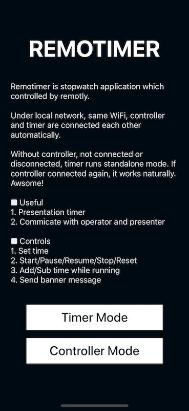
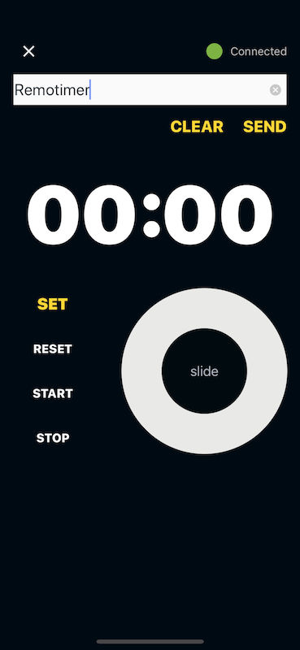

# REMOTIMER

Remotimer is stopwatch application which controlled by remotly.

- Under local network, same WiFi, controller and timer are connected each other automatically.

- Without controller, not connected or disconnected, timer runs standalone - mode. If controller connected again, it works naturally. Awsome!

### Useful

1. Presentation timer
2. Commicate with operator and presenter

### Controls

1. Set time
2. Start/Pause/Resume/Stop/Reset
3. Add/Sub time while running
4. Send banner message

### Screenshots

### Appstore

### One more Thing

This is opensource project :
[https://github.com/iamchiwon/remotimer](https://github.com/iamchiwon/remotimer)

### LICENSE

Remotimer is available under the MIT license. See the LICENSE file for more info.

